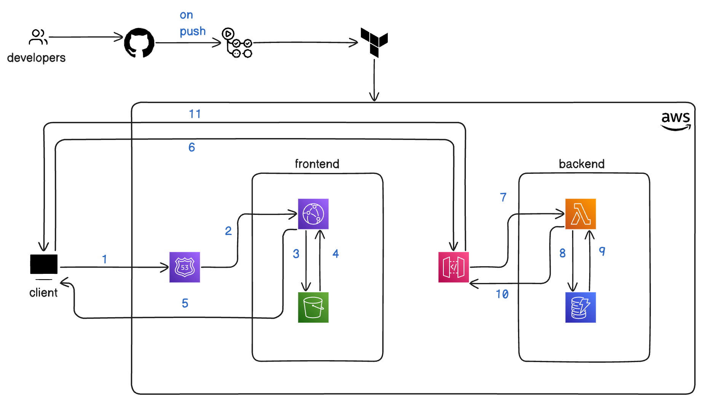

# Cloud Resume Challenge on AWS

This repo hosts the code for my approach towards solving cloud resume challenge on AWS. 

This is the high level architecture diagram of the project

AWS Tools I have used
  - Route 53
  - CloudFront
  - Simple Storage Service (S3)
  - API Gateway
  - Lambda
  - Dynamo DB

Infrastructure tools
  - Terraform

CICD tools
  - github
  - github actions

Languages, Libraries and Frameworks used
 - Frontend
    - Next.js
    - Tailwind css
    - Cypress
 - Backend
    - Python
    - Pytest